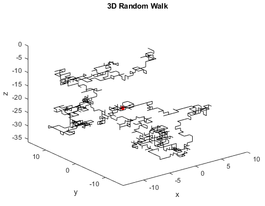

## Brownian Motion

[Science Projects](../README.md) > [Brownian Motion](./README.md)

Offers a particle based simulation of 1D Brownian motion, then shows that it is analogous to a 1D random walk by comparing the dependences of displacement and mean-squared-distance to time (constant at 0 and linear, respectively). Also simulates random walks in n-dimensions, and shows visual animations of 1D, 2D, and 3D random walks.

### How to Use

The files in this project are `.m` files and require MATLAB to run.
* particleSims
    * `particle.m`: A function that simulates a fluid in 1D with the ideal gas conditions. Initially has particles with velocities in Boltzmann distribution. Takes parameters `N` = Number of particles, `r` = Radius of each particle, `m` = Mass of each particle, and `d` = Initial spacing between particles. Parameters must constitute a low Reynold environment for best simulation.
    * `particleAnalysis.m`: Simulates a number of 1D fluids, then plots the mean displacement and mean-squared-distance over time to show that they are constant at 0 and linear, respectively. Each simulation takes around 1.2 seconds to run, making 100 simulations take 2 minutes to run and 500 simulations 10 minutes to run.
    * `particleVisual.m`: Shows an animation of a fluid in 1D, with one of the particles highlighted red to clearly show its behavior.
* randomwalks
    * `walkND.m`: A function that simulates an N-dimensional walk given the number of dimensions, the starting position, the number of steps, and the step size. Returns an array containing all the positions visited during the walk.
    * `walkNDanalysis.m`: Runs 100 simulations of 1000 step random walks, then calculates the mean final displacement and the mean final squared displacement, and also plots the mean displacement and the mean squared displacement over the number of steps, showing that they are constant at 0 and linear, respectively.
    * `walk1Dvisual.m`: Shows an animated graph of the position over step number.
    * `walk2Dvisual.m`: Shows an animation of a point moving in a random walk in a 2D plane.
    * `walk3Dvisual.m`: Shows an animation of a point moving in a random walk in a 3D space.

### Future Plans / Known Issues
* When you try to put real physical constants (e.g. for water) in the program, you need to simulate a large number of particles to get a low Reynolds environment, which makes the simulation take excessively long.
    * This could potentially be solved by adding intermolecular forces to make the fluids non-ideal/more viscous.
* Making the random walk omnidirectional rather than only going along the dimensional axes.
