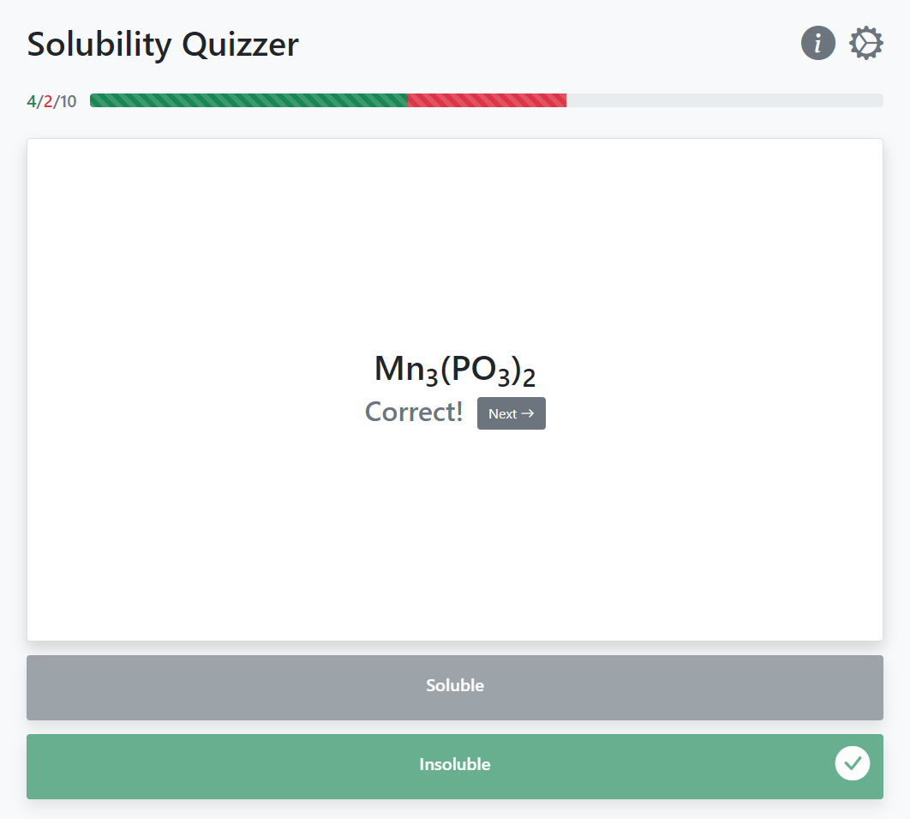
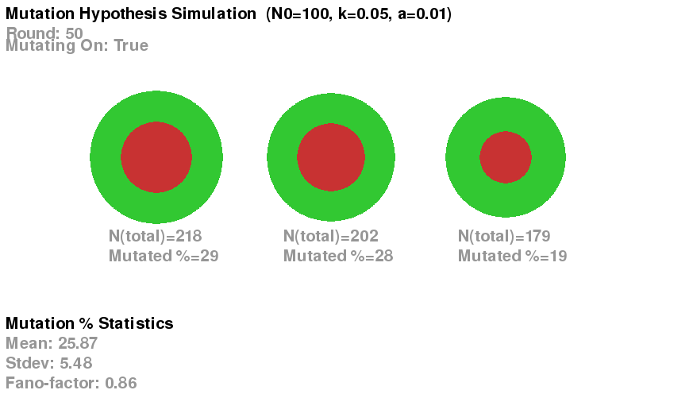
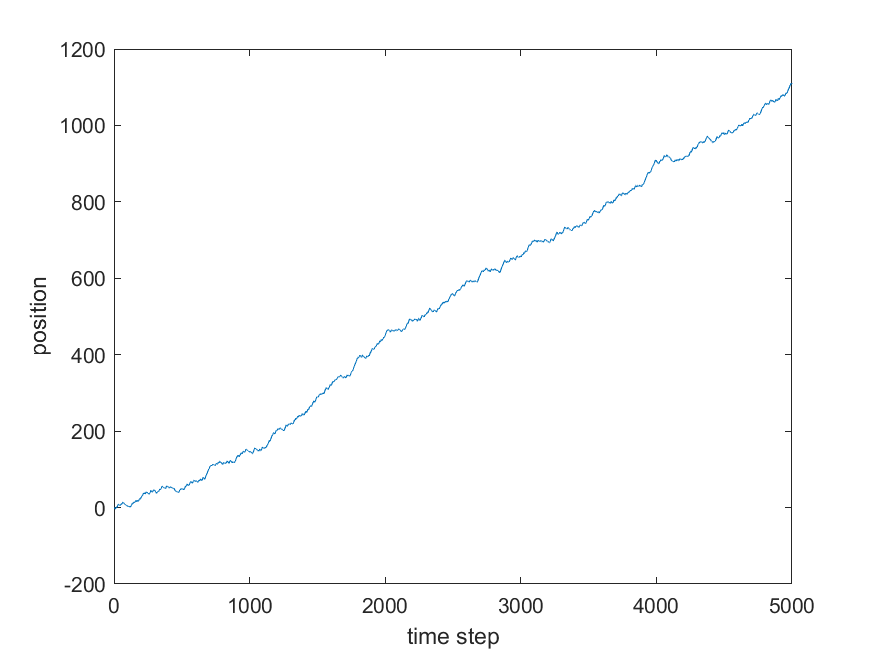

# Science Simulations
A collection of simulations based on famous labs. This README offers brief summaries about the different projects. View each project's folder to see specific features and run instructions.

<table>
    <tr>
        <td width="30%">
            
        </td>
        <td>
            <h3>Solubility Quizzer</h3>
            
            
Automatically generates ionic compounds and quizzes the user on their solubility.

        </td>
    </tr>
</table>

<table>
    <tr>
        <td width="30%">
            
        </td>
        <td>
            <h3>Brownian Motion</h3>
            
            
Offers a particle based simulation of 1D Brownian motion, then shows that it is analogous to a 1D random walk by comparing the dependences of displacement and mean-squared-distance to time. Also simulates random walks in n-dimensions, and shows visual animations of 1D, 2D, and 3D random walks.

        </td>
    </tr>
</table>

<table>
    <tr>
        <td width="30%">
            
        </td>
        <td>
            <h3>Luria-Delbrück Fluctuation Test</h3>
            
            
A simulator of the Luria-Delbrück Fluctuation Test, which showed that the "mutation hypothesis"--that mutations arose randomly independent of their environment--was correct, as opposed to the "acquired immunity hypothesis"--that mutations occured as an adaptive response to an environmental stimulus.

        </td>
    </tr>
</table>

<table>
    <tr>
        <td width="30%">
            
        </td>
        <td>
            <h3>Run-and-Tumble Chemotaxis</h3>
            
            
A simulation of a run-and-tumble chemotaxis on a linear chemical gradient.

        </td>
    </tr>
</table>
