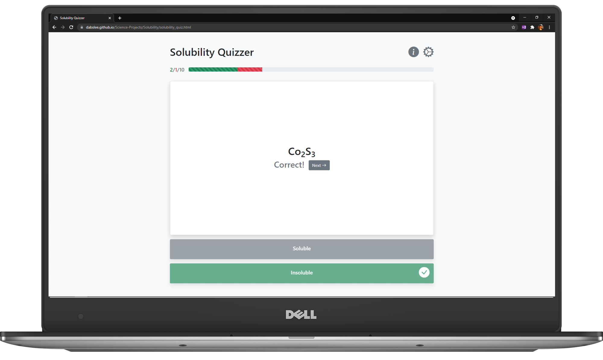
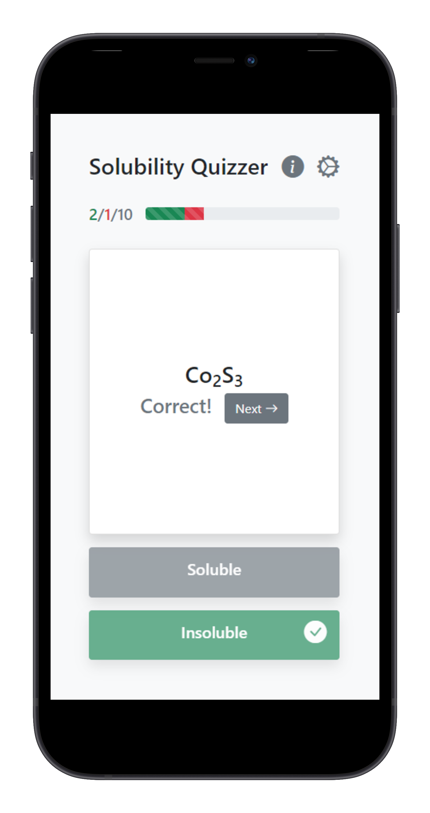

## Solubility Quizzer

[Science Projects](../README.md) > [Solubility](./README.md)

    

This project automatically generates ionic compounds and quizzes the user on their solubility. 

Built as an exercise in using Bootstrap5 components and ReactJS to make a simple, responsive, fully front-end app.

 

### Future Plans / Known Issues
* Add an option to not repeat problems.
* Add an option to only quiz on missed problems.